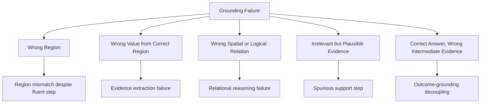

# CG-PRM Proposal
## Counterfactual Grounding Process Reward Models for Verifiable Multimodal Reasoning

**Version:** Draft v1.0  
**Short name:** `CG-PRM`  
**Target venues:** NeurIPS / ICLR

---

## Abstract

Process reward models (PRMs) have emerged as a promising mechanism for supervising and selecting reasoning traces in multimodal large language models, yet current PRMs still track reasoning fluency more reliably than reasoning grounding. As a result, they often assign high scores to traces that are coherent in language but unsupported by the actual visual evidence, especially when the final answer happens to be correct. This failure is particularly problematic for verifiable multimodal reasoning, where the core requirement is not merely to produce plausible explanations, but to distinguish evidence-faithful traces from answer-correct but visually ungrounded ones.

We argue that the missing ingredient in current multimodal verifier training is not more outcome supervision, but supervision that explicitly targets whether evidence is used correctly.

This proposal introduces **CG-PRM**, a counterfactual-grounding process reward model for verifiable multimodal reasoning. The central idea is to train a multimodal PRM not only on clean reasoning traces, but also on **hard counterfactual grounding negatives**: traces that remain locally fluent while breaking visual faithfulness at a specific intermediate step. CG-PRM combines three components: a canonical structured trace schema for multimodal reasoning, an automated pipeline for generating five families of grounding-specific counterfactual negatives, and a LoRA-trained visual PRM that predicts per-step groundedness scores together with a final trace score for best-of-N reranking.

To keep the empirical claim sharp and executable within 40 days, the core study is deliberately scoped to **two primary benchmarks**: **CLEVR** as the low-noise causal anchor and **DocVQA** as the realistic visual-text grounding setting. The main evaluation question is not whether CG-PRM improves reasoning everywhere, but whether it improves verifier sensitivity on the hardest failure mode, namely **answer-correct but evidence-wrong traces**. We evaluate CG-PRM on step-level error detection, human-written hard negatives, cross-corruptor transfer, fixed-budget reranking, and free-form robustness. At a higher level, the proposal treats this as a **grounding-sensitive supervision recipe** problem: can multimodal verifiers be improved by a scalable, automatically constructed, and rigorously validated training signal that targets evidence use rather than answer correctness alone?

---

## 1. Motivation and Problem Statement

Multimodal large language models have become increasingly capable at generating long-form reasoning traces for charts, documents, diagrams, and general visual question answering. However, recent work, including the survey in this project, shows that answer accuracy alone is an insufficient measure of trustworthy reasoning. A model can produce the right answer for the wrong reasons, or generate a visually plausible chain of thought that fails to correspond to the actual evidence in the image. This gap between **plausibility** and **verifiability** is now one of the central bottlenecks in multimodal reasoning.

The problem is especially acute for process reward models. PRMs are attractive because they provide step-level feedback and can be used to rerank candidate reasoning traces at inference time. Yet current multimodal PRMs inherit a structural weakness from their training data: most traces are labeled according to answer correctness or completion success, not according to whether each intermediate step is visually grounded. In practice, this means that PRMs often learn a mixed signal that conflates three different properties:

1. local linguistic coherence,
2. agreement with the final answer, and
3. actual grounding in visual evidence.

The third property is the one that matters most for verifiable reasoning, but it is often the weakest supervised signal.

This proposal takes the position that the most important failure mode is not simply "wrong answer + wrong reasoning." The more dangerous case is **answer-correct but evidence-wrong reasoning**. Such traces are easy to miss under standard evaluation because the outcome is correct, the language is fluent, and the reasoning structure appears normal. However, if PRMs cannot reject such traces, then they cannot serve as reliable verifiers for multimodal reasoning systems.

The core research question is therefore:

> **Can a multimodal PRM be trained to score visual faithfulness rather than prose plausibility by exposing it to hard counterfactual traces that are fluent but locally ungrounded?**

This question is tightly aligned with the open problems identified in the survey: current benchmarks emphasize answer accuracy over process metrics, existing systems lack robust step-level grounding tests, and reliable step rewards remain underdeveloped for multimodal reasoning. CG-PRM is designed as a direct response to these gaps.

The primary contribution is therefore a **counterfactual-grounding supervision method for multimodal verifiers**. The surrounding evaluation protocol is not intended to replace the method contribution, but to establish whether the method learns genuine grounding rather than synthetic artifacts.

---

## 2. Research Hypothesis and Core Thesis

### 2.1 Research Hypothesis

The central hypothesis of this project is:

> A multimodal process reward model trained on **hard counterfactual grounding negatives** will learn a sharper notion of visual faithfulness than a PRM trained only on clean traces or final-answer supervision, and this sharper notion will improve both step-level error detection and test-time trace reranking.

### 2.2 Core Thesis

The proposal advances three linked claims.

First, multimodal PRMs fail in part because their supervision does not distinguish sufficiently between *fluent reasoning* and *grounded reasoning*. Second, this gap can be narrowed by constructing training examples in which only one step is corrupted while local fluency is preserved, forcing the verifier to attend to the visual-evidence mismatch rather than shallow textual cues. Third, if the verifier signal is genuinely improved, that improvement should survive gold and transfer checks and can then be **stress-tested** in best-of-N reranking under fixed inference budgets.

CG-PRM is therefore positioned as a **faithfulness and verifiability verifier**, not as a new agent architecture and not as an RL method. The proposal also makes a second commitment: it prioritizes one core scientific claim over broad coverage. Everything in the experiment matrix is subordinated to the question of whether counterfactual supervision improves grounding sensitivity on answer-correct but evidence-wrong cases.

---

## 3. Proposed Method: CG-PRM

### 3.1 Overview

CG-PRM consists of four stages:

1. **Clean trace generation** using a strong multimodal teacher model.
2. **Automatic verification** of each trace under a task-specific canonical step schema.
3. **Counterfactual grounding corruption** that mutates one step at a time while keeping the surrounding language fluent.
4. **LoRA-based PRM training and inference-time reranking** using per-step groundedness scores and a final trace score.

The overall system is intentionally lightweight. It requires no new pretraining, no reinforcement learning, and no full-model fine-tuning. The primary model stack is:

- **Teacher / trace generator:** `Qwen2.5-VL-7B-Instruct`
- **Primary PRM backbone:** `Qwen2.5-VL-3B-Instruct`

The `3B` PRM is the only model used for the core claim. A larger `7B` verifier, if ever run, will be treated as a non-blocking supplementary extension and not as part of the main paper story.

### 3.2 Canonical Trace Schema

All training and evaluation traces follow a unified structured schema:

| Field | Description |
|---|---|
| `image` | The visual input for the example |
| `question` | The user question or task instruction |
| `step_id` | Integer index of the reasoning step |
| `step_text` | Natural-language description of the current step |
| `step_type` | Step category such as `locate`, `read`, `relate`, `compute`, or `answer` |
| `grounding_ref` | Explicit reference to the visual evidence used by the step |
| `evidence_value` | Extracted value, object, relation, span, or number used in the step |
| `label` | Binary groundedness label for the step |
| `error_type` | `none` for clean steps, otherwise one of the five counterfactual families |

This schema enforces a fixed decomposition of reasoning into evidence-relevant steps and makes it possible to supervise the PRM at the step level rather than only at the trace level.

### 3.3 Primary Benchmark Scope and Canonical Traces

To control experimental debt, the core paper will use **two primary benchmarks only**.

#### Primary Benchmark 1: DocVQA

The canonical trace is:

`locate document span -> extract OCR or text evidence -> derive answer`

The `locate` step identifies the text region or line group relevant to the answer. The `extract` step retrieves the answer-supporting token span or key-value content. The `derive` step either outputs the extracted answer directly or performs lightweight normalization.

Automatic verification uses OCR tokens and span alignment. Supervision is restricted to cases where the answer can be linked to a specific OCR-backed span or a deterministic normalization of that span.

#### Primary Benchmark 2: CLEVR

The canonical trace is:

`identify relevant objects -> state relation, count, or attribute -> derive answer`

CLEVR provides a controlled environment because symbolic scene metadata makes step verification exact. This benchmark functions as the causal analysis anchor of the proposal: it isolates whether CG-PRM learns true step grounding under minimal annotation noise.

#### Optional Supplementary Extension: ChartQA

`ChartQA` is explicitly moved out of the core claim. If the core pipeline stabilizes early, it can be used as a supplementary transfer study for numerical and chart-grounding generalization. No main-paper claim will depend on ChartQA.

### 3.4 Clean Trace Generation

Clean candidate traces are generated by `Qwen2.5-VL-7B-Instruct` under prompt templates that explicitly request the canonical step structure for each benchmark. To reduce teacher-style overfitting, each example is generated under multiple prompt paraphrases and sampling temperatures, producing a small bank of candidate clean traces rather than one fixed teacher trace.

Only traces that pass the automatic verification rules are admitted as clean supervision targets. This filtering step is important: CG-PRM is not trained to imitate raw teacher output, but to reason over a curated set of evidence-faithful traces.

### 3.5 Counterfactual Grounding Negatives

The key novelty of CG-PRM is the generation of **hard counterfactual grounding negatives**. Each negative trace is created by mutating one step at a time while keeping the surrounding narrative locally fluent. The proposal locks exactly five counterfactual families:

1. **Wrong region with fluent step text**  
   The step references a plausible but incorrect chart region, document span, or object subset.

2. **Correct region but wrong extracted attribute or value**  
   The grounding location is correct, but the evidence value is changed to an incorrect yet plausible attribute, token, or number.

3. **Wrong spatial or logical relation**  
   The referenced objects or spans are reasonable, but the relation among them is corrupted.

4. **Irrelevant yet plausible evidence step**  
   The step introduces evidence that looks relevant at the language level but does not support the question.

5. **Correct final answer with incorrect intermediate evidence**  
   The trace preserves the correct answer while at least one earlier step uses unfaithful evidence, creating the most challenging verifier case.

These counterfactuals are deliberately chosen to break grounding rather than style. The PRM should not be able to solve the task by noticing awkward wording, uncommon syntax, or obvious contradictions.

### 3.6 PRM Interface and Scoring Rule

The verifier input is:

`(image, question, full trace)`

The output is:

- a **per-step groundedness score** for each step in the trace,
- a **final trace score** used for reranking.

The trace score follows a fixed aggregation rule:

1. compute the mean of all step scores,
2. apply an explicit penalty if any grounding-critical step falls below a fixed threshold.

This design prevents a high average score from masking a catastrophic grounding failure in a crucial evidence step.

### 3.7 Training Scope

CG-PRM is trained with **LoRA only** on the `3B` backbone. The proposal explicitly excludes:

- full-model tuning,
- reinforcement learning,
- policy optimization,
- new pretraining objectives.

This scope is not merely a compute constraint. It is part of the scientific design: the proposal aims to isolate the value of **counterfactual grounding supervision** without confounding it with a larger policy-training stack.

### 3.8 Why CG-PRM Is Not Redundant with Direct Evidence Supervision

The proposal includes an evidence-supervision baseline precisely because the two approaches are not identical.

**Direct evidence supervision** answers the question: *which region, span, or token appears to support the answer?*  
**CG-PRM** answers the question: *is this full reasoning trace using evidence correctly and faithfully?*

CG-PRM is expected to have independent value in three situations:

1. **Trace-level verification rather than evidence extraction**  
   The deployment use case is reranking full candidate traces, not only selecting evidence spans.

2. **Answer-preserving misuse of correct evidence**  
   A model may attend to the correct span or object but still make an unfaithful intermediate claim about what that evidence implies. Evidence localization alone does not fully detect this case.

3. **Lower annotation burden across tasks**  
   CG-PRM relies on verifiable clean and counterfactual traces, whereas dense evidence supervision often requires explicit span or region labels.

For this reason, the final evaluation will include a dedicated **correct-evidence but wrong-use** subset. If an evidence predictor wins uniformly on that subset, the paper's claim will be narrowed accordingly.

### 3.9 Taxonomy of Correct-Evidence but Wrong-Use Errors

To make the comparison against evidence supervision operational rather than rhetorical, the proposal defines **correct-evidence but wrong-use** errors in three concrete categories:

1. **Correct evidence, wrong attribute readout**  
   The trace points to the correct span, object, or region, but reads the wrong attribute or value from it.

2. **Correct evidence, wrong relation or composition**  
   The trace uses the correct evidence items but states an incorrect relation, ordering, or composition among them.

3. **Correct evidence, wrong inference from correct facts**  
   The trace identifies the correct supporting facts but draws an invalid intermediate conclusion or computation from them.

Instantiation by benchmark:

- **DocVQA**: primarily categories 1 and 3, with a smaller number of category-2 cases in multi-field or layout-sensitive questions.
- **CLEVR**: primarily categories 2 and 3, with category 1 instantiated as incorrect attribute binding over correctly identified objects.

Construction policy:

- categories 1 and 2 can be generated automatically for both synthetic and semi-structured data,
- category 3 is partly automatic in CLEVR and partly reserved for the human-written challenge set in DocVQA.

This taxonomy is important because a pure evidence localizer may succeed on the evidence anchor while still missing whether the reasoning trace uses that evidence correctly.

---

## 4. Training Data Construction and Quality Control

### 4.1 Automatic Labeling Policy

Automatic labels are used wherever possible. The step label is `1` only if the step is both structurally valid and consistent with the task-specific evidence source. Otherwise it is `0`, and `error_type` records the corruption family. Manual annotation is not used as the primary supervision source.

Instead, the project reserves a **100-200 sample manual audit** for quality control. The audit serves three purposes:

1. verify that clean traces are truly grounded,
2. verify that counterfactual traces remain locally fluent,
3. verify that automatic labels are not dominated by shallow artifacts.

### 4.2 Non-Triviality Checks

Because synthetic negatives can accidentally become too easy, CG-PRM includes explicit hardness checks before training:

- compare lexical statistics of clean and corrupted traces,
- test a text-only classifier on the negatives,
- reject corruption templates that can be separated by shallow wording patterns,
- maintain task-balanced corruption rates across the five families.

This step is essential. If the negatives are trivial, then the PRM will learn to detect synthetic artifacts rather than genuine grounding failures.

### 4.3 Human-Written Grounding Challenge Set

The proposal upgrades the manual check from a symbolic sanity check into a formal evaluation artifact.

The **human-written grounding challenge set** will be built only for the two primary benchmarks, `CLEVR` and `DocVQA`. For each benchmark, the target artifact is:

- **100 matched trace pairs** per benchmark,
- for a total of **200 traces per benchmark** and **400 traces overall**.

Each pair contains:

1. one grounded reference trace,
2. one human-written ungrounded trace matched on step count and overall style.

The negative trace must satisfy four conditions:

1. **fluent**,
2. **locally plausible**,
3. **visually unsupported**,
4. **not trivially separable by wording alone**.

The negative set will emphasize the paper's core failure mode:

- **50% answer-correct but evidence-wrong**,
- **25% answer-wrong but locally plausible**,
- **25% partially grounded or mixed-failure cases**.

Annotation protocol:

1. a primary annotator writes the ungrounded trace from a verified clean trace,
2. a second annotator independently labels fluency, plausibility, visual support, and answer-correctness status,
3. disagreements are adjudicated by a third reviewer,
4. a 20-example pilot calibration round is run before full annotation.

Statistical protocol:

1. the **primary metric** on this set is **paired ranking accuracy**,
2. **trace-level AUPRC** is the secondary metric,
3. all reported scores include **bootstrap confidence intervals**,
4. the paper will not claim a grounding advantage from this set unless the effect is both directionally consistent and clearly above the uncertainty interval.

This set is **evaluation-only**. It is not used for training and not used to tune decision thresholds.

### 4.4 Synthetic Artifact Defenses

The central threat to validity is that CG-PRM might learn to detect synthetic corruption templates rather than genuine grounding failures. The proposal therefore includes three explicit defenses.

#### A. Cross-Corruptor Generalization

The training pipeline will use one family of corruption generators, while at least one evaluation split will be built with an **independently implemented corruptor**. The second corruptor should differ in prompt style, mutation order, and paraphrase policy, and whenever possible should be generated by a different language model or a rule-based postprocessor. A large drop under this setting would indicate template overfitting rather than real grounding sensitivity.

#### B. Human-Written Hard-Negative Set

The project will use the formal artifact defined in **Section 4.3** as the gold-standard sanity check for the claim that CG-PRM learns grounding rather than merely synthetic artifacts.

#### C. Counterfactual Image or Evidence Swap Interventions

The evaluation suite will include intervention tests in which:

1. the trace is fixed and the image or relevant evidence region is swapped,
2. the image is fixed and the grounding anchor in the trace is swapped,
3. the final answer is held constant while the supporting evidence is perturbed.

A verifier that truly tracks grounding should respond strongly to these interventions.

### 4.5 Coverage, Selection Bias, and External Validity

Because automatic verification is easier on strongly aligned examples, the proposal must explicitly measure how much of each dataset remains after filtering and what is lost through this process.

For each benchmark, the final paper will report:

1. **coverage rate**: what fraction of the full benchmark remains in the verifiable supervision subset,
2. **distribution shift from full set to retained subset**: question length, answer type, document subtype or scene complexity, OCR noise level, reasoning depth, and other task-relevant complexity indicators,
3. **performance on a weak-verification setting**: a broader and noisier evaluation slice where labels may be weaker but the data distribution is more natural.

This design ensures that the proposal does not hide behind a small, unusually clean, and potentially unrepresentative subset.

### 4.6 Free-Form Evaluation Tiers

The proposal now defines free-form evaluation in three explicit tiers rather than treating it as a binary label.

1. **Canonical**  
   Explicit step decomposition and explicit schema fields such as `step_type` and `grounding_ref`.

2. **Lightly structured**  
   Step-by-step reasoning is requested, but no explicit grounding slots or schema fields are injected.

3. **Natural free-form**  
   The model is prompted with a normal reasoning request and produces unconstrained long-form output. Only minimal post-hoc sentence or clause segmentation is used; no schema fields are added back into the trace.

This tiered design allows the paper to report exactly where CG-PRM begins to lose robustness. If the method works only in the canonical tier, then the claim must be restricted accordingly.

For reproducibility, the segmentation protocol will follow a **fixed deterministic rule** based on punctuation and a pre-registered list of discourse markers, with no task-specific manual adjustment and no post-hoc tuning based on model performance.

### 4.7 Schema Robustness and Causal Isolation

Another threat is that performance gains may come from the canonical schema itself rather than from counterfactual supervision. The proposal therefore separates the contribution of structure from the contribution of hard-negative training.

The final evaluation will include:

1. **schema-only vs schema-plus-counterfactual** comparisons,
2. **free-form trace evaluation**, where candidate traces come from natural model outputs rather than only canonical templates,
3. **partial schema relaxation**, where step segmentation is retained but fields such as `step_type` or `grounding_ref` are hidden from the verifier.

If CG-PRM only works when every structural field is explicitly injected, then its scientific claim must be weakened accordingly. The proposal therefore treats schema robustness as a first-class empirical question rather than a hidden assumption.

### 4.8 OOD Holdout Strategy

To test generalization, one counterfactual family will be held out from training in at least one evaluation condition. This creates an out-of-distribution setting where the verifier must detect a new type of grounding failure rather than memorizing the corruption templates seen during training.

---

## 5. Experimental Plan

### 5.1 Primary and Secondary Baselines

To prevent scope inflation, the proposal distinguishes **primary baselines** from **secondary diagnostics**.

Primary baselines:

1. **Visual PRM trained on clean traces only**, without counterfactual grounding negatives
2. **Pairwise verifier baseline**, which directly compares two traces and predicts which one is better grounded
3. **Strong VLM-as-a-judge baseline**, using a larger multimodal model as a high-cost upper baseline for trace judging
4. **Evidence-supervision baseline**, which directly predicts supporting regions, spans, or evidence items on the verifiable subset
5. **Matched-budget self-consistency baseline**

Secondary diagnostics:

6. **Answer-only scoring / outcome reward model**
7. **Text-only PRM without image input**

The paper's main comparisons will be made against the first five baselines. The secondary baselines remain useful, but they will not be treated as the key standard of evidence.

#### Strong Judge Baseline Contract

The **strong VLM-as-a-judge baseline** will follow a fixed experimental contract:

1. a **single fixed judge model** is chosen before the main runs; the primary judge should be a reproducible, high-capability open multimodal model whenever possible,
2. judging is **single-round only** for the primary result table, with no multi-turn interaction,
3. the judge input always contains the **image, question, and full trace**,
4. a single prompt template is used across benchmarks, with only minimal task identifiers where necessary,
5. no self-consistency or multi-sample judging is allowed in the main comparison,
6. judge cost is reported explicitly and compared separately from CG-PRM under matched-budget conditions,
7. if a stronger closed-source judge is included, it will appear as a **supplementary upper baseline**, not as the main reproducible comparator.

### 5.2 Primary Evaluations

The proposal uses three primary evaluation tracks.

#### A. Step-Level Error Detection

Measure whether the verifier can separate grounded and ungrounded steps on clean and counterfactual traces.

#### B. Trace Reranking

Generate `N` candidate traces per example, score them with the PRM, and rerank them using the fixed aggregation rule. The main application target is **best-of-N reranking**, not policy optimization.

#### C. OOD Generalization

Measure whether a model trained on a subset of counterfactual families still detects unseen grounding failures.

#### D. Cross-Generator Evaluation

Candidate traces for reranking will not come from a single generator only. The evaluation will mix at least three generation sources:

1. `Qwen2.5-VL-7B-Instruct`,
2. one additional open multimodal model,
3. a decoding-regime variant such as greedy, temperature sampling, or self-consistency candidates.

This test is necessary to distinguish a genuine verifier from a ranker that merely prefers the style of its own teacher.

### 5.3 Required Scenarios

The evaluation must explicitly include the following cases:

1. **answer wrong + reasoning wrong**
2. **answer correct + reasoning correct**
3. **answer wrong + reasoning partly grounded**
4. **answer correct + reasoning ungrounded**

The fourth case is the most important one. It is the setting in which conventional outcome-based supervision is weakest and where CG-PRM should provide the clearest advantage.

In addition, the evaluation will include:

5. **human-written fluent but ungrounded traces**
6. **cross-corruptor synthetic traces**
7. **image-swap or evidence-swap interventions**

### 5.4 Core Metrics

The proposal reports:

- **step-level AUROC and AUPRC** for grounded-vs-ungrounded step detection,
- **trace-level ranking quality**,
- **final task accuracy after reranking**,
- **cost overhead** from best-of-N reranking,
- **coverage rate** of each verified subset,
- **cost-normalized accuracy and faithfulness gains** under matched inference budgets.

In addition, the proposal will report benchmark-specific evidence metrics where available, such as evidence attribution quality or exact step verification rates.

For reranking, every main result will be paired with a **fixed-budget comparison** against stronger self-consistency or larger `N` sampling under matched token, latency, or FLOPs budgets. This is necessary to show that CG-PRM adds value beyond simply generating more candidates.

For the human-written grounding challenge set, the reporting protocol is fixed in advance:

- primary metric: **paired ranking accuracy**,
- secondary metric: **trace-level AUPRC**,
- uncertainty reporting: **bootstrap confidence intervals**,
- repeated-run reporting: **multiple random seeds** for all trainable verifiers.

### 5.5 Conclusion Priority and Interpretation Plan

To avoid fragmented conclusions under mixed results, the paper will interpret findings in a fixed priority order.

#### Tier 1: Core Scientific Claim

Does counterfactual grounding supervision significantly reduce false acceptance of **answer-correct but evidence-wrong** traces relative to strong baselines?

#### Tier 2: Gold and Transfer Validation

Does the same advantage survive on the **human-written grounding challenge set** and on the **cross-corruptor split**?

#### Tier 3: Practical Utility

Does any verifier advantage remain useful under **fixed-budget reranking**?

#### Tier 4: Interface Dependence

At which point does performance degrade across **canonical**, **lightly structured**, and **natural free-form** traces?

This hierarchy determines how the paper will be written. If Tier 1 holds but Tier 3 does not, the paper remains a verifier-supervision contribution rather than a practical reranking contribution. If Tier 1 weakens outside canonical traces, the claim will be explicitly scoped to structured reasoning interfaces.

### 5.6 Core vs Secondary Experiment Matrix

To keep the paper executable within the 40-day budget, the experiment matrix is split into **core** and **secondary** studies.

Core studies:

1. `CLEVR` + `DocVQA`
2. clean-only visual PRM vs CG-PRM
3. pairwise verifier baseline
4. strong VLM-as-a-judge baseline
5. evidence-supervision baseline
6. one cross-corruptor split
7. one human-written grounding challenge set
8. one fixed-budget reranking study
9. one schema robustness study

Secondary studies, to be moved to supplementary or future work if time is tight:

1. `ChartQA`
2. text-only and answer-only diagnostics
3. broader corruption-family sweeps beyond the main split
4. wider decoding-regime coverage beyond the main reranking comparison

### 5.7 Main-Text Necessary vs Supplementary Ablations

To preserve scope control, the ablation plan is split into **main-text necessary** and **supplementary desirable** analyses.

Main-text necessary:

1. **clean-only visual PRM vs CG-PRM**
2. **schema-only vs schema-plus-counterfactual**
3. **canonical vs natural free-form**
4. **one cross-corruptor split**

Supplementary desirable:

1. **random negatives vs counterfactual grounding negatives**
2. **single-step corruption vs multi-step corruption**
3. **each of the five error families independently**
4. **mean aggregation vs min-sensitive aggregation**
5. **single-generator reranking vs cross-generator reranking beyond the main comparison**
6. **lightly structured tier analysis in full detail**

### 5.8 Proposal Success Criteria

The proposal defines success in two layers.

Core scientific success:

1. **CG-PRM must outperform the clean-trace visual PRM on hard-negative detection.**
2. **The verifier must retain a measurable advantage on the human-written grounding challenge set and at least one unseen counterfactual family.**
3. **Coverage and subset-bias statistics must be reported for every benchmark.**

Conditional utility success:

4. **If the paper claims practical verifier utility, CG-PRM must remain competitive under fixed-budget reranking comparisons.**

In addition, the proposal treats the following as required validity checks:

5. **CG-PRM must preserve a non-trivial advantage on the human-written hard-negative set or the core grounding claim must be weakened.**
6. **If reranking gains are weak or unstable, the paper will not frame reranking as a core contribution.**

The proposal adopts an **effect-size discipline** rather than hard hand-set thresholds:

7. **The core claim requires gains that are materially above run-to-run variance and uncertainty intervals on the answer-correct but evidence-wrong subset.**
8. **Small directional gains that are comparable to run variance, bootstrap uncertainty, or decoding noise will be treated as insufficient to support the main claim.**
9. **Scientific interpretation will prioritize whether the gain is practically meaningful for verifier acceptance errors, not merely whether it is numerically non-zero.**

These are proposal-level targets, not claimed results.

---

## 6. Expected Contributions

The proposal organizes its contribution around three primary claims.

### Contribution 1: A counterfactual-grounding supervision recipe for multimodal verifiers

CG-PRM introduces a supervision design in which multimodal PRMs are trained not only on clean traces, but on grounding-specific counterfactual negatives that force the verifier to distinguish correct evidence use from fluent but unfaithful reasoning.

### Contribution 2: A rigorous identification protocol for grounding-sensitive gains

The proposal develops the empirical apparatus required to test whether the above recipe learns genuine grounding rather than artifacts: a unified trace schema, a formal human-written grounding challenge set, cross-corruptor validation, free-form tiers, subset-bias reporting, and a fixed contract for strong-judge comparison.

### Contribution 3: A systematic empirical study of answer-correct but evidence-wrong failures

The proposal centers the paper on the most dangerous multimodal verifier failure mode and studies it across a low-noise causal setting (`CLEVR`) and a realistic visual-text setting (`DocVQA`), with fixed-budget reranking treated as a stress test of utility rather than a guaranteed practical payoff.

---

## 7. Paper Positioning Strategy

The proposal explicitly prepares for two plausible final paper positions.

### Position A: Method-First Paper

If CG-PRM shows clear and variance-robust gains on Tier-1 and Tier-2 conclusions, the paper will be framed primarily as a **method paper** about counterfactual grounding supervision for multimodal verifiers.

### Position B: Method + Protocol Paper

If the evaluation framework proves stronger than the absolute method gain, the paper will be framed as a **method-plus-evaluation-protocol paper**: the main contribution becomes grounding-faithfulness evaluation for multimodal verifiers, and CG-PRM is presented as the strongest instantiation under that protocol.

This positioning flexibility is deliberate. It reduces the risk of misframing a solid empirical paper as a stronger method paper than the evidence ultimately supports.

---

## 8. Risks, Failure Modes, and Mitigation

### Risk 1: Counterfactual negatives are too easy

If the corruptions introduce lexical artifacts, the PRM may solve the task without attending to grounding.

**Mitigation:** run text-only hardness checks, filter weak templates, and use multiple paraphrase styles during clean-trace generation and corruption.

### Risk 2: The human-written grounding challenge set is too small or too weakly specified

If the human evaluation set is underpowered or loosely defined, it will not support the paper's strongest claim.

**Mitigation:** fix the artifact at 100 matched pairs per benchmark with double annotation, adjudication, controlled scenario coverage, bootstrap confidence intervals, and evaluation-only usage.

### Risk 3: The verifier overfits to one teacher model's trace style

A PRM that only recognizes a single teacher's phrasing may fail on diverse candidate traces.

**Mitigation:** generate multiple candidate traces per example under prompt paraphrases and sampling variation, and include cross-generator reranking with at least one non-teacher model plus different decoding regimes.

### Risk 4: The verifier learns synthetic corruption patterns rather than grounding

If the PRM succeeds only on traces produced by the same corruptor family used in training, then the core scientific claim is invalid.

**Mitigation:** use cross-corruptor evaluation, a human-written hard-negative set, and image-swap or evidence-swap interventions as required validity tests.

### Risk 5: The method fails on truly natural free-form traces

If the model only works on lightly canonicalized traces, then its practical generalization value is limited.

**Mitigation:** use the three-tier free-form protocol and report exactly where performance drops.

### Risk 6: Canonical schema regularization explains the gains

If the model works only when explicit structured fields are injected, then the improvement may come from schema simplification rather than counterfactual supervision.

**Mitigation:** include schema-only, free-form, and partial-schema-relaxation ablations to isolate the actual causal factor.

### Risk 7: Reranking gains are too small to justify the additional compute

If the verifier improves step detection but not end-task accuracy, the paper risks becoming a narrow analysis result.

**Mitigation:** report both verification and cost metrics, compare under fixed inference budgets, and explicitly position step-faithfulness detection as the primary contribution if reranking gains are modest but consistent.

### Risk 8: Direct evidence supervision dominates CG-PRM on the verifiable subset

If direct evidence supervision wins everywhere, then the PRM story becomes scientifically weaker.

**Mitigation:** isolate the subset where the correct evidence is present but used incorrectly, and test whether trace-level verification still offers unique value there.

---

## 9. Pipeline Figure

```mermaid
flowchart LR
    A["Image + Question"] --> B["7B Teacher Generates Canonical Clean Traces"]
    B --> C["Task-Specific Automatic Verification"]
    C --> D["Verified Clean Trace Bank"]
    D --> E["Counterfactual Grounding Corruptor"]
    E --> F["Five Hard-Negative Families"]
    D --> G["3B CG-PRM LoRA Training"]
    F --> G
    G --> H["Per-Step Groundedness Scores"]
    H --> I["Trace Score Aggregation with Critical-Step Penalty"]
    I --> J["Best-of-N Trace Reranking"]
```

---

## 10. Error Taxonomy Figure

---

## 11. Forty-Day Execution Plan

| Days | Objective | Deliverables |
|---|---|---|
| 1-5 | Finalize the two primary benchmarks, human-set protocol, teacher prompts, verification rules, and subset-coverage diagnostics | Canonical trace spec, prompt pack, annotation guide, subset-bias checklist |
| 6-10 | Generate pilot clean traces, run manual audit, and measure retained-subset coverage on CLEVR and DocVQA | Pilot trace bank, 100-sample audit, retained-subset report |
| 11-15 | Implement all five counterfactual generators, an independent second corruptor, and the three-tier free-form protocol | Counterfactual generator suite, cross-corruptor split, free-form prompt pack, hardness diagnostics |
| 16-21 | Build the first full training set, train 3B CG-PRM, and construct the human-written grounding challenge set | v1 PRM checkpoint, early step-detection metrics, gold human challenge set |
| 22-27 | Run the core benchmark matrix: clean-only PRM, pairwise verifier, strong judge, evidence supervision, and matched-budget reranking | Main result tables on CLEVR and DocVQA, fixed-budget comparison plots |
| 28-32 | Execute the core validity studies: schema robustness, OOD family transfer, cross-generator reranking, and intervention tests | Schema/free-form analysis, OOD generalization analysis, image/evidence-swap results |
| 33-36 | Consolidate effect-size analysis and only run supplementary ChartQA transfer if the core story is already stable | Core punchline figures, optional supplementary transfer |
| 37-40 | Write the final academic proposal and polish figures | Final proposal, pipeline figure, error taxonomy figure, main experiment tables |

### Day-33 Quality Gate

The proposal no longer requires a main-track `7B` verifier scale-up. The day-33 gate is now used for scope control:

1. if the core claim is already supported on `CLEVR` and `DocVQA`, optional `ChartQA` transfer can be attempted as supplementary evidence;
2. if the core claim is still unstable, all remaining time is spent on effect-size analysis, error diagnosis, and writing discipline rather than on wider experiments.

---

## 12. Resource Plan

The proposal is explicitly scoped to a **maximum budget of 4xA800 over 40 days**.

- All primary runs are **LoRA-scale**.
- The main model is the `3B` PRM.
- The core paper depends on two benchmarks, not three.
- A larger `7B` verifier is explicitly outside the main scope.
- Data construction is automated-first and designed to minimize human annotation cost.

This budget is compatible with the scientific goal of the paper: validating whether counterfactual grounding supervision materially improves multimodal verification without relying on expensive end-to-end retraining.

---

## 13. Conclusion

CG-PRM is a focused proposal for improving verifiable multimodal reasoning at the verifier level. Instead of introducing a new reasoning policy, it targets the quality of the training signal used to score reasoning traces. The proposal argues that current PRMs are limited because they see too few examples of fluent-but-ungrounded reasoning. By constructing hard counterfactual grounding negatives across charts, documents, and synthetic compositional scenes, CG-PRM aims to teach a multimodal PRM to reward **faithfulness to evidence** rather than mere narrative plausibility.

If successful, this work would offer a practical and compute-efficient path toward more trustworthy multimodal reasoning systems: better step-level error detection, better trace reranking, and a cleaner methodology for evaluating whether a model actually reasons from visual evidence.
